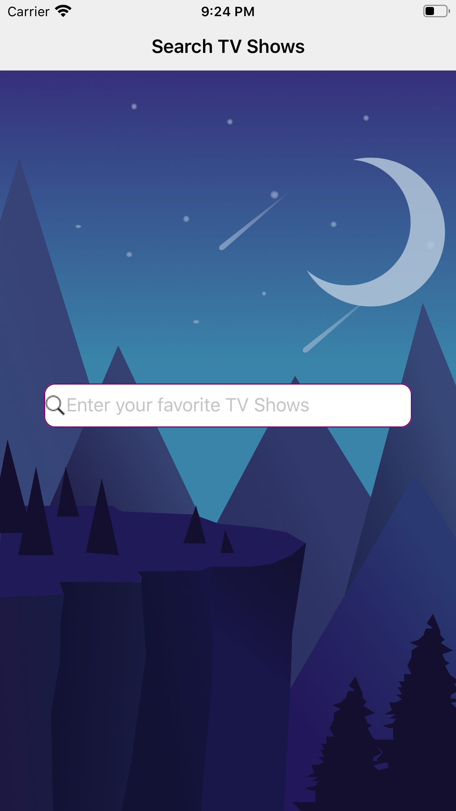
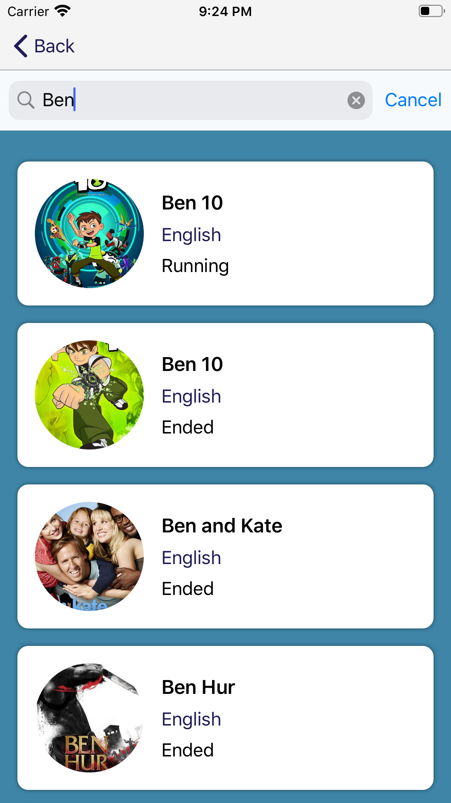
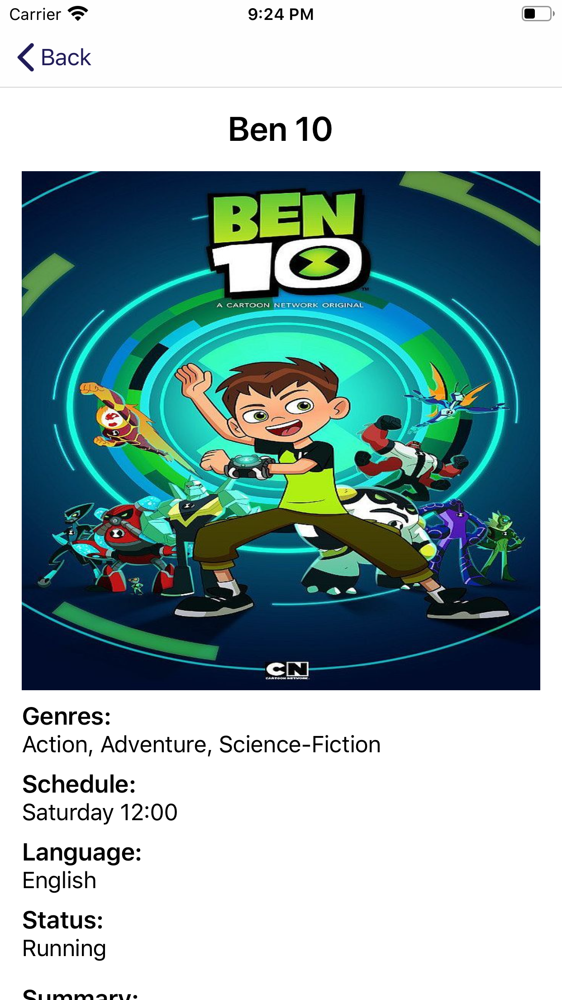
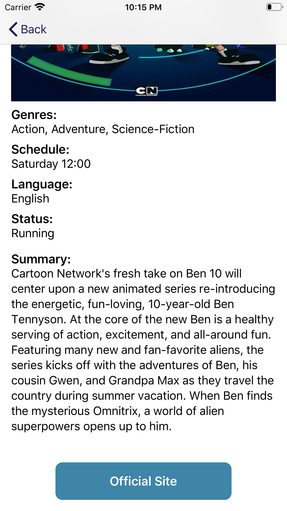

# SearchTVShows

This app allows a user to search for TV shows and displays list of tv shows and details about the selected tv show.

## Implementation Details:

The app is using TV Maze API, http://www.tvmaze.com/api.

Endpoint used after adding a search text(example: "Ben") ,in the query to show the searched tv show list is:
http://api.tvmaze.com/search/shows?q=Ben

Screenshots are attched below.

### Model used for showing detailed view

Below mentioned data is extracted from the json response which is used to displaying tv show data in different views.

```
var id: Int
var name: String
var language: String?
var genres: [String]?
var officialSite: String?
var schedule: ScheduleData?
var rating: RatingsData?
var summary: String?
var image: ImageData?
var status: String?
```

- MVC(Model view controller) design pattern is used in this application.
- Interacting with REST endpoint using HTTP method GET.

## Dependencies Used:
- [SwiftLint](https://github.com/realm/SwiftLint) is used to enforce swift coding styles for the project.
- [SVProgressHUD](https://github.com/SVProgressHUD/SVProgressHUD) is used to display progress of any ongoing task.
- [Lottie](https://github.com/airbnb/lottie-ios) is used for animations.
- [SnapKit](https://github.com/SnapKit/SnapKit) is used for auto layout to create UI.
- [AlamofireImage](https://github.com/Alamofire/AlamofireImage) is used for caching image.

### Screenshots:







